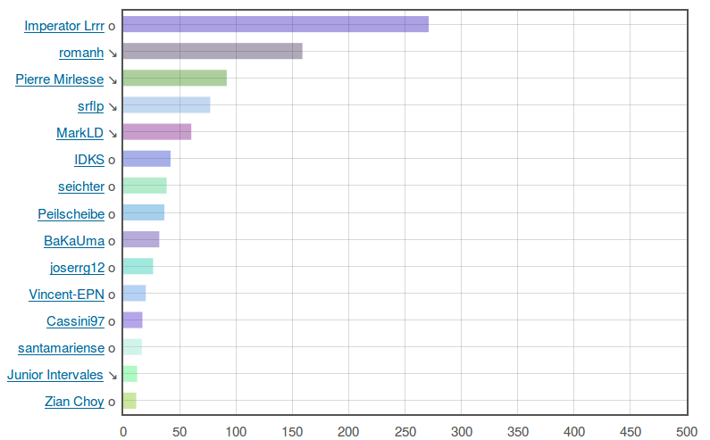

# Live Stats

Shows live user statistics from OpenStreetMap.

## What it looks like

Or try it out on the [live server](http://www.gryph.de:8080) (note, uses port 8080 so be aware of firewall issues). 

## How it works

There's a server component written in Perl (this was meant to be rapid 
prototype for something I'd later do in C++ but then proved totally 
sufficient as-is). The server loads minutely diffs from OSM and parses
them, and for each minute keeps a hash with user names and associated
edit counts. (The server doesn't currently discard anything so it'll
fill up your RAM after a couple of months... or years.)

For convenience, the server acts as a web server and delivers the index
page and JS/CSS files needed by the front end (see below), though this is
really just a gimmick.

There server has a JSON API where you can basically ask for a list of users
and edit counts for any time span, and what you get back is a JSON array with
user names and edit counts. 

Then there's a small front-end made with JQuery and Flot that will show
a nice bar chart with user edits. The front-end interpolates between two
subsequent minutely diffs so that you see "something moving". Of course it's
cheating a bit (in a "show me the way" kind of fashion). 

## Hacking it

Once you've got one or two additional Perl modules installed, you should be
able to simple do `perl daemon.pl` and then connect to localhost:8080 with 
your web browser. 

If you don't want to run the server yourself, you can build something on top
of the API of the live server on www.gryph.de:8080 but that server is really 
just for playing and there's zero service level guarantee (and the API could
change any time). 

## License

Everying is PD except the Flot and JQuery libraries in the "js" directory
which come under their respective licenses, see the .js files.
